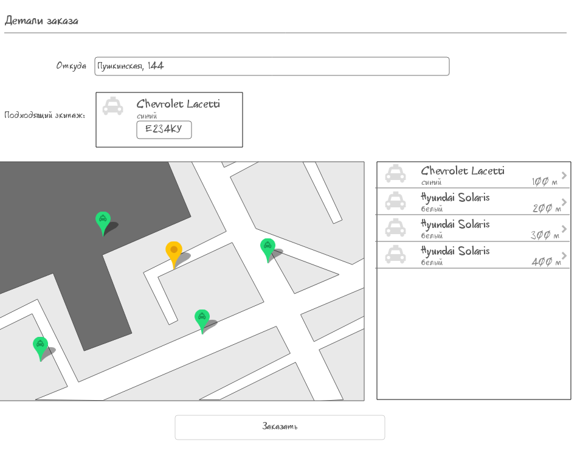

# Страница заказа такси с формой и картой.



## Форма заказа:

“Откуда” - вводится адрес подачи такси, обязательное поле.
Формат ввода "Улица, номер дома".
На карте должен отобразиться желтый маркер в этом месте.
Если адрес не найден, то поле считается не валидным.
Также можно заполнить это поле, щелкнув на карте в нужном месте.
Также при отправке формы передаются поля source_time (время подачи) и crew_id (ИД выбранного экипажа), смотрите описание запроса создания в конце задания.
Валидация полей происходит после изменения значений полей.
При щелчке по кнопке "Заказать" происходит полная валидация формы и кнопка становится недоступной пока все ошибки не исправлены.
Например, если, заполняя поля сразу нажать кнопку "Заказать",
то под полем "Откуда" появится подсказка, что это поле обязательное.

## Карта:

Предлагается использовать Яндекс-карты (можете взять более удобные вам карты).
При щелчке на карте
- ищется адрес выбранного места,
- заменяется текущее значение поля "Откуда",
- в месте щелчка появляется желтый маркер,
- на сервер отправляется запрос поиска подходящих экипажей,
- найденные экипажи отображаются на карте зелеными маркерами и выводятся в список экипажей отсортированными по возрастанию расстояния до точки подачи.

Первый экипаж из этого списка считается "подходящим" и отображается под формой заказа.
Если адрес не найден, то в месте щелчка появляется красный маркер с подписью "Адрес не найден".

Получение подходящих экипажей и создание заявки просто мокаем. Реализация должна включать в себя 2 функции:

Пример данных на входе
```js
    data: {
    crews_info: [
      {
        crew_id: 123,
        car_mark: "Chevrolet",
        car_model: "Lacetti",
        car_color: "синий",
        car_number: "Е234КУ",
        driver_name: "Деточкин",
        driver_phone: "7788",
        lat: 56.855532,
        lon: 53.217462,
        distance: 300
      },{
        crew_id: 125,
        car_mark: "Hyundai",
        car_model: "Solaris",
        car_color: "белый",
        car_number: "Ф567АС",
        driver_name: "Петров",
        driver_phone: "8899",
        lat: 56.860581,
        lon: 53.209223,
        distance: 600
      }
    ]
  }
```
Пример данных на выходе:
```js
{
  source_time: "20130101010101",
    addresses: [
      {address: "Пушкинская, 144",
      lat: 56.839439,
      lon: 53.218803},
  ],
    crew_id: 123
}
```
